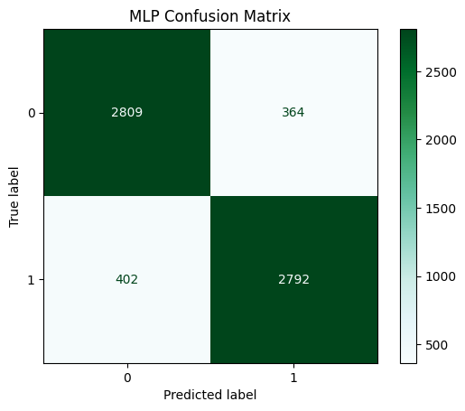
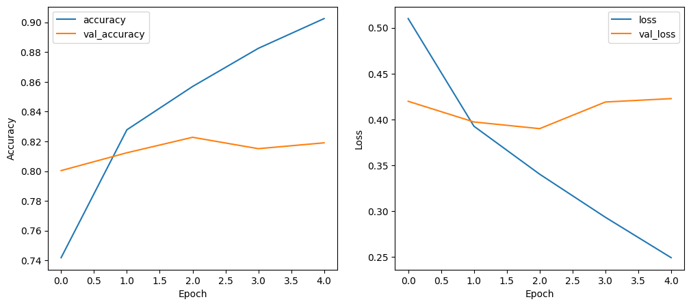

# 🎬 Movie Reviews Sentiment Analysis

[](https://www.python.org/)  

A deep learning project that predicts the **sentiment of movie reviews** (positive or negative) from the **IMDb Movie Ratings Dataset** using **CNN** and **MLP** models.

---

## **Project Overview**
This project analyzes IMDb movie reviews to classify them as positive (`1`) or negative (`0`).  
It leverages **text preprocessing**, including tokenization and stopwords removal, and applies **deep learning models** for sentiment prediction.

- **Input:** Movie review text  
- **Output:** Sentiment label (`positive` or `negative`)  

---

## **Dataset**
- **Source:** IMDb Movie Ratings Dataset  
- **Total Reviews:** 40,000  
- **Labels:**  
  - `1` → Positive  
  - `0` → Negative  

> The dataset is included in the `dataset/` folder for convenience.


---

## **Installation**

1. **Clone the repository**
```bash
git clone https://github.com/darshbir19/Movie-review-sentimental-analysis.git
cd Movie-Reviews-Sentiment-Analysis
```

2. **Create and activate a virtual enviroment**
```bash
python -m venv venv
venv\Scripts\activate        # Windows
source venv/bin/activate     # macOS/Linux
```

3. **Install dependancies**
```bash
pip install -r requirements.txt
```
---
## **Usage**

1. **Prepare the dataset**

Place the IMDB dataset CSV files in the dataset/ folder.
Ensure the files are named correctly as expected by the scripts.

2. **Run preprocessing**
```bash
python src/preprocess.py
```

2. **Train the models**
```bash
python src/train.py
```

3. **Evaluate or use the trained models**

The trained CNN and MLP models will be saved as .keras files in the repository.

You can load them in Python for inference or further experimentation:
```py
from tensorflow.keras.models import load_model

cnn_model = load_model("src/cnn_model.keras")
mlp_model = load_model("src/mlp_model.keras")
```
---
## **Results**


### MLP training history


### MLP confusion matrix


### CNN training history


### CNN confusion matrix

---

## **Credits / Acknowledgements**
This project was inspired by the **COMP 2211** coursework at HKUST.  
Special thanks to the course instructors and materials for providing foundational concepts in **machine learning and deep learning**, which guided the development of this project.
